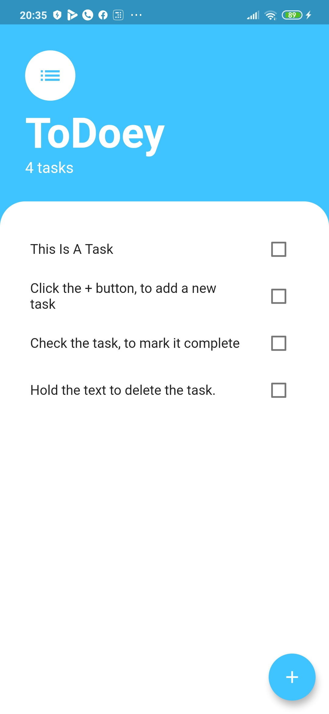

# todoey

A todo-list application, made using flutter

## ChangeLog:

### v1.3.3
Minor bug fixes

### v 1.3.2
Added the possibility for multiple reminders scheduling.

### v 1.3.0
Added reminder feature. Now you can ask for a notification for a specific to do item.

### v 1.2.0
Added a local storage functionality. Keeps store of the data, and initialises the to do list from the stored data.

### v 1.0.0
Initial creation. Shows the to do list, can edit the list, add and delete items.

### Screenshot:

